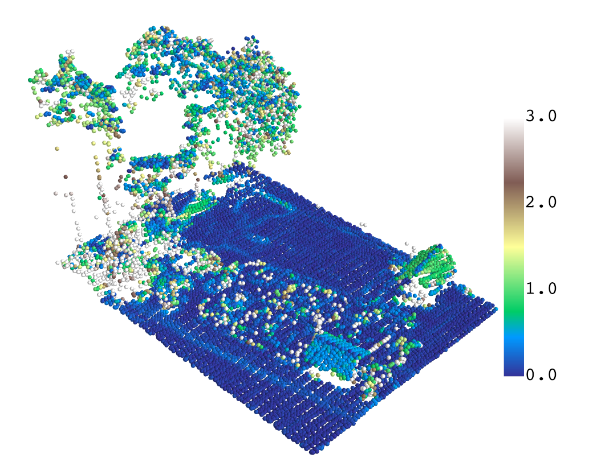

.. Laserchicken documentation master file, created by
   sphinx-quickstart on Thu Oct  3 15:28:52 2019.
   You can adapt this file completely to your liking, but it should at least
   contain the root `toctree` directive.

Welcome to Laserchicken's documentation!
========================================
Laserchicken is a user-extendable, cross-platform Python tool for
extracting statistical properties (features in machine learning jargon)
of flexibly defined subsets of point cloud data.

.. toctree::
   :maxdepth: 2
   :caption: Contents:

User manual
===========

Laserchicken processes point clouds from Airborne Laser Scanning in LAS/LAZ format, and normalizes, and filters the points, finds neighbors for targeted points and calculates features.

.. image:: figures/workflow.png
  :alt: Laserchicken workflow

The figure shows the default workflow for which Laserchicken was intended. In short, a point cloud is loaded from a LAS or LAZ or PLY file. After this, points can be filtered by various criteria, and the height can be normalized. A point cloud of targets are loaded. See below a description of what is the concept of a target point. For every target point, neighbors will be computed. Based on the list of neighbors, features are extracted that effectively describe the neighborhood of each target point.

Environment and target point cloud
==================================

In Laserchicken, the LiDAR dataset is referred to as the environment point cloud (EPC), and the subsets of points over which a metric is to be calculated are referred to as neighborhoods. Each neighborhood is defined by a target volume and a target point (e.g. a cube of a certain size and its centroid, respectively), with all points enclosed in the volume constituting the neighborhood.

See below an illustration of a target point cloud (green points) representing the centroids of a regular grid cell, and the neighborhoods (red points) defined by a square infinite cell target volume (red columns). Features are calculated over the neighborhood of each target point and then associated with the target point, thus forming the enriched target point cloud (eTPC). Points that are not included in the neighborhoods are shown in in black.

.. image:: figures/targets.png
  :width: 450
  :alt: targets and environment point cloud

Four volume definitions are implemented: an infinite square cell, an infinite cylinder, a cube and a sphere.

.. image:: figures/cell.png
  :width: 300
  :alt: cell
.. image:: figures/cylinder.png
  :width: 300
  :alt: cylinder
.. image:: figures/sphere.png
  :width: 300
  :alt: sphere
.. image:: figures/voxel.png
  :width: 300
  :alt: voxel

All target points together form the target point cloud (TPC). The TPC can be freely defined by the user, and can be for instance identical to the environment point cloud or alternatively a regular grid as illustrated above.
Features are calculated over the list of neighborhoods, with the feature values being associated with each neighborhood's defining target point, thus forming the enriched target point cloud (eTPC).

Modules
=======

Each module from the workflow is described below and an example of its usage is given. If you need more examples, be sure to have a look of the unit tests in the Laserchicken's source code.

Load
----

The load module provides functionality to load  point cloud datasets provided in ASPRS LAS/LAZ, or in PLY format, and is used for both input point clouds. In conjunction with
the PDAL library (https://pdal.io/), this provides access to a comprehensive range of point cloud data formats.

Example from the tutorial notebook::

   from laserchicken import load
   point_cloud = load('testdata/AHN3.las')

Normalize
---------

A number of features require the normalized height above ground as input. Laserchicken provides the option of internally constructing a digital terrain model (DTM) and deriving this quantity. To this end, the EPC is divided into small cells 1m or 2.5m squared). The lowest point in each cell is taken as the height of the DTM. Each point in the cell is then assigned a normalized height with respect to the derived DTM height. This results in strictly positive heights and smooths variations in elevation on scales larger than the cell size. The normalized EPC can be used directly in further analysis, or serialized to disk.

Example from the tutorial notebook::

   from laserchicken.normalize import normalize
   normalize(point_cloud)

Filter
------
Laserchicken provides the option of filtering the EPC prior to extracting features. Points may be filtered on the value of a single attribute relative to a specified threshold (e.g. above a certain normalized height above ground), or on specific values of their attributes (e.g. LAS standard classification). It is also possible to filter with (geo-)spatial layers such as polygons (e.g. regions of interest, land cover types), i.e. selectively including or excluding points.

Example of spatial filtering from the tutorial notebook::

   from laserchicken.filter import select_polygon
   polygon = "POLYGON(( 131963.984125 549718.375000," + \
                      " 132000.000125 549718.375000," + \
                      " 132000.000125 549797.063000," + \
                      " 131963.984125 549797.063000," + \
                      " 131963.984125 549718.375000))"
   point_cloud = select_polygon(point_cloud, polygon)

Example of applying a filter on the theshold of an attribute::

   from laserchicken.filter import select_above, select_below
   points_below_1_meter = select_below(point_cloud, 'normalized_height', 1)
   points_above_1_meter = select_above(point_cloud, 'normalized_height', 1)

Compute neighbors
-----------------

The Compute neighbors module constructs the neighborhoods as defined by the TPC
and target volume by identifying the points in the EPC which reside in the specified volume
centered on the target points, returning each as a list of indices to the EPC. This essential step of computing neighboring points for large samples of points is computationally expensive. Laserchicken uses the optimized ckDtree class (kdTrees are a space-partitioning data structure) provided by the scipy library to organize both the EPC
and TPC in kdTrees in an initial step prior to the computation of neighbors, subsequently accelerating the process of computing neighbors by using the indices of the points with respect to the kDtrees.

Example from the tutorial notebook::

   from laserchicken import compute_neighborhoods
   from laserchicken import build_volume
   targets = point_cloud
   volume = build_volume('sphere', radius=5)
   neighborhoods = compute_neighborhoods(point_cloud, targets, volume)

Note that in the above example, ``neighborhoods`` is a generator and can only be iterated once. If you would want to do multiple calculations without recalculating the neighbors, you can copy the neighborhoods to a list. This is not done by default because neighborhoods can quickly grow quite large so that available RAM unnecessarily becomes the bottle neck.

Features
--------

Feature extraction requires the EPC, the TPC, the computed list of neighborhoods, and a list of requested features as input. For each target point it selects the points of the associated neighborhood and calculates a vector of the requested features over these. This feature vector is appended to the target point, thus defining the eTPC.

Currently, a number of features are implemented, including percentiles of the height distribution and eigenvectors. Computationally expensive calculations requiring multi-dimensional linear algebraic operations (e.g. eigenvectors and eigenvalues) have been vectorized using the einsum function of the numpy library to optimize performance. Their implementation can serve as a
template for new features requiring similar operations.

Example from the tutorial notebook::

   from laserchicken import compute_features
   compute_features(point_cloud, neighborhoods, targets, ['std_z','mean_z','slope'], volume)

Features can be parameterized. If you need different parameters than their defaults you need to register them with these prior to using them.

Example of adding a few parameterized band ratio features on different attributes::

   from laserchicken import register_new_feature_extractor
   from laserchicken.feature_extractor.band_ratio_feature_extractor import BandRatioFeatureExtractor
   register_new_feature_extractor(BandRatioFeatureExtractor(None,1,data_key='normalized_height'))
   register_new_feature_extractor(BandRatioFeatureExtractor(1,2,data_key='normalized_height'))
   register_new_feature_extractor(BandRatioFeatureExtractor(2,None,data_key='normalized_height'))
   register_new_feature_extractor(BandRatioFeatureExtractor(None,0,data_key='z'))

The currently registered features can be listed as follows::

   from laserchicken.feature_extractor import list_feature_names
   sorted(list_feature_names())

Which outputs something like::

   ['band_ratio_1<normalized_height<2',
    'band_ratio_2<normalized_height',
    'band_ratio_2<normalized_height<3',
    'band_ratio_3<normalized_height',
    'band_ratio_normalized_height<1',
    'band_ratio_z<0',
    'coeff_var_norm_z',
    'coeff_var_z',
    'density_absolute_mean_norm_z',
    'density_absolute_mean_z',
    'echo_ratio',
    'eigenv_1',
    'eigenv_2',
    'eigenv_3',
    'entropy_norm_z',
    'entropy_z',
    'kurto_norm_z',
    'kurto_z',
    'max_norm_z',
    'max_z',
    'mean_norm_z',
    'mean_z',
    'median_norm_z',
    'median_z',
    'min_norm_z',
    'min_z',
    'normal_vector_1',
    'normal_vector_2',
    'normal_vector_3',
    'perc_100_normalized_height',
    'perc_100_z',
    'perc_10_normalized_height',
    'perc_10_z',
    ...
    'perc_99_normalized_height',
    'perc_99_z',
    'perc_9_normalized_height',
    'perc_9_z',
    'point_density',
    'pulse_penetration_ratio',
    'range_norm_z',
    'range_z',
    'sigma_z',
    'skew_norm_z',
    'skew_z',
    'slope',
    'std_norm_z',
    'std_z',
    'var_norm_z',
    'var_z']

The following table includes the list of all implemented features:

.. table::
   :widths: 35 30 25 10

   ============================================================  ========================================================================================================================================  ===========================================================  ==================================
    Feature name                                                  Formal description                                                                                                                        Example of use                                               Refs.
   ============================================================  ========================================================================================================================================  ===========================================================  ==================================
   Point density (``point_density``)                             :math:`N/A` where :math:`S` is the neighborhood target volume (area) for finite (infinite) cells                                          Point cloud spatial distribution                             |
   Pulse penetration ratio (``pulse_penetration_ratio``)         :math:`N_{\mathrm{ground}}/N_{\mathrm{tot}}`                                                                                              Tree species classification                                  :cite:`yu2014`
   Echo ratio (``echo_ratio``)                                   :math:`N_{\mathrm{sphere}}/N_{\mathrm{cylinder}}`                                                                                         Roof detection                                               :cite:`car2009`
   Skewness (``skew_z``) [a]_                                    :math:`1/\sigma^3 \cdot \sum{(Z_i - \bar{Z})^3/N}`                                                                                        Vegetation, ground, and roof classification and detection    :cite:`Crosilla2013`
   Kurtosis (``kurto_z``) [a]_                                   :math:`1/\sigma^4 \cdot \sum{(Z_i - \bar{Z})^4/N}`                                                                                        Vegetation, ground, and roof classification and detection    :cite:`Crosilla2013`
   Standard deviation (``std_z``) [a]_ [b]_                      :math:`\sqrt{\sum{(Z_i - \bar{Z})^2/(N - 1)}}`                                                                                            Classification of reed within wetland                        :cite:`zlinszky2012`
   Variance (``var_z``) [a]_                                     :math:`\sum{(Z_i - \bar{Z})^2/(N - 1)}`                                                                                                   Classification of reed within wetland                        :cite:`zlinszky2012`
   Sigma Z (``sigma_z``) [a]_                                    :math:`\sqrt{\sum{(R_i - \bar{R})^2/(N - 1)}}` where :math:`R_i` is  the residual after plane fitting                                     |                                                            :cite:`zlinszky2012`
   Minimum Z (``min_z``) [a]_ [b]_                               :math:`Z_{\mathrm{min}}`                                                                                                                  Simple digital terrain model in wetlands                     :cite:`zlinszky2012`
   Maximum Z (``max_z``) [a]_ [b]_                               :math:`Z_{\mathrm{max}}`                                                                                                                  Height and structure of forests                              :cite:`naesset2002`
   Mean Z (``mean_z``) [a]_ [b]_                                 :math:`\sum{Z_{i}}/N`                                                                                                                     Height and structure of forests                              :cite:`naesset2002`
   Median Z (``median_z``) [a]_                                  :math:`Z_{\mathrm{median}}`                                                                                                               Height and structure of forests                              :cite:`naesset2002`
   Range Z (``range_z``) [a]_ [b]_                               :math:`|Z_{\mathrm{max}} - Z_{\mathrm{min}}|`                                                                                             Height and structure of forests                              :cite:`naesset2002`
   Percentiles Z (``perc_X_z`` with ``X`` in (0:100]) [a]_       Height of every :math:`10^{\mathrm{th}}` percentile.                                                                                      Height and structure of forests                              :cite:`naesset2002`
   Eigenvalues (``eigenv_X``, with ``X`` in (1,2,3))             :math:`\lambda_1, \lambda_2, \lambda_3 ` , with :math:`|\lambda_1| \ge |\lambda_2| \ge |\lambda_3|`                                       Classification of urban objects                              :cite:`weinmann2017`
   Normal vector (``normal_vector_X``, with ``X`` in (1,2,3))    eigen vector :math:`\vec{v}_3`                                                                                                            Roof detection                                               :cite:`Dorninger2008`
   Slope (``slope``)                                             :math:`\tan(\mathrm{arccos}(\vec{v}_3\cdot\vec{k}))` , where :math:`\vec{k} = [0,0,1]^T`                                                  Planar surface detection                                     :cite:`doi:10.1002/esp.3606`
   Entropy Z  (``entropy_z``) [a]_                               :math:`-\sum_{i}{P_i \cdot \mathrm{log}_2{P_i}}`, with :math:`P_i = N_i/\sum_{j}{N_j}`  and :math:`N_i` points in bin :math:`i`           Foliage height diversity                                     :cite:`Bae2014`
   Coefficient variance Z (``coeff_var_z``) [a]_ [b]_            :math:`\frac{1}{\bar{Z}} \cdot \sqrt{\sum{\frac{(Z_i - \bar{Z})^2}{N - 1}}}`                                                              Urban tree species classification                            :cite:`koma2016urban`
   Density absolute mean (``density_absolute_mean_z``) [a]_      :math:`100 \cdot \sum [Z_i > \bar{Z}]/N`                                                                                                  Urban tree species classification                            :cite:`koma2016urban`
   Band ratio (``band_ratio_Z1<z<Z2``) [c]_                      :math:`N_{Z_1<Z<Z_2}/N_{\mathrm{tot}}` where :math:`Z_1` and :math:`Z_2` are user-provided values                                         Height and structure of forests                              |
   ============================================================  ========================================================================================================================================  ===========================================================  ==================================

.. [a] Also available for the normalized height (e.g. ``mean_normalized_height``)
.. [b] Also available for the intensity (e.g. ``mean_intensity``)
.. [c] Fully customizable in variable and range

Below is an example. The figure visualizes the slope feature for a small neighborhood size. We used the same target point cloud as the environment point cloud. The image was generated using mayavi plotting software (https://docs.enthought.com/mayavi/mayavi/).

Export
------

Laserchicken can write to PLY or LAS/LAZ format for further analysis with the user's choice of software. The PLY format is preferred, as it is flexibly extendable and is the only format Laserchicken will write provenance data to. It is also a widely supported point cloud format.

Example from the tutorial notebook::

   from laserchicken import export
   export(point_cloud, 'my_output.ply')

.. bibliography:: bibliography.bib
   :cited:
   :style: unsrt

